# SE-Azure-Lab
This repo contains API code for the Software Engineering Foundations Guild intern Azure lab.

# Step 1: Get Your Visual Studio Enterprise Subscription

Go to https://azure.microsoft.com/en-us/offers/ms-azr-0063p/

Click `Activate` and enter your information.

To verify it worked, go to https://portal.azure.com and go to Subscriptions, turn off the "global" filter, and search for "Visual Studio Enterprise Subscription". You should see the subscription in the list.

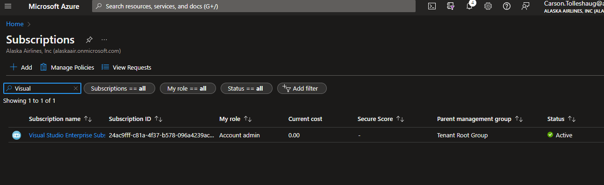

# Step 2: Create an App Service

From the portal home page, click the `Create a Resource` button.

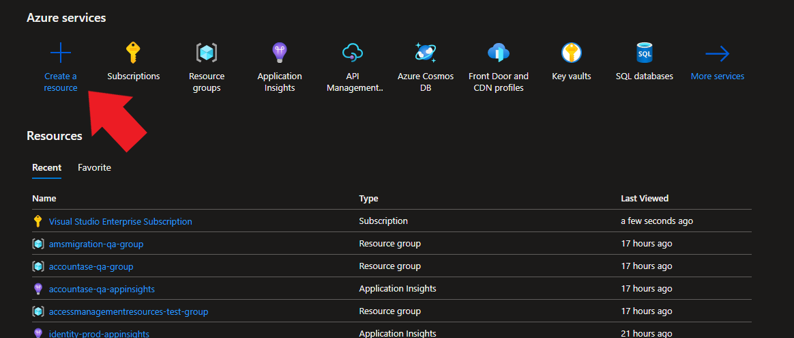

From there select "Web App"

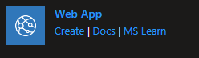

- Set "Subscription" to `Visual Studio Enterprise Subscription`
- Click the "Create New" button under the resource group selection, and give it a unique name
- Set "Name" to a unique, memorable name (the name will be part of your URL later)
- Keep "Publish" set to `Code`
- Set "Runtime Stack" to `.NET 6 (LTS)`
- Set "Operating System" to `Windows`
- Keep "Region" set to whatever it defaults to
- Click the "Create New" button under the "Windows Plan" selection, and give it a unique name
- Change "Sku and size" to `F1` under the "Dev / Test" section.

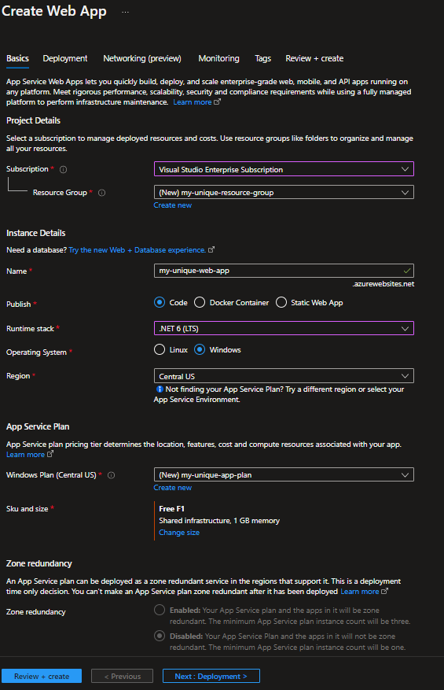

Click the "Review + create" button. Ensure that everything looks good, and then click the "Create" button.

# Step 3: Create a Cosmos Database

From the portal home page, click the `Create a Resource` button. This time select "Azure Cosmos DB".

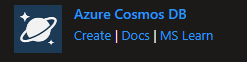

Select "Azure Cosmos DB API for MongoDB" as your API option.

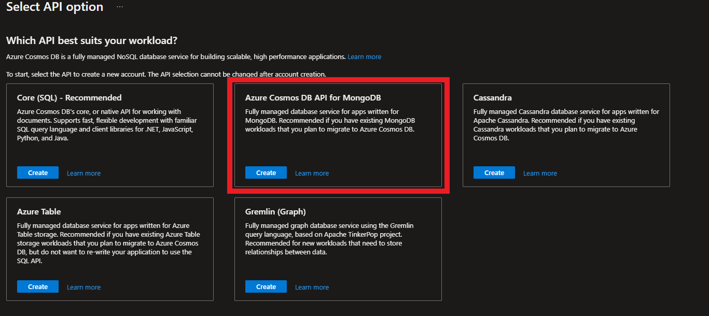

- Set "Subscription" to `Visual Studio Enterprise Subscription`
- Set "Resource Group" to the resource group you created in the previous step
- Set "Account Name" to a unique name
- Keep "Location" set to whatever it defaults to
- Keep "Capacity mode" set to `Provisioned throughput`
- (Optional) Check the "Limit total account throughput" checkbox
- Keep "Version" set to `4.0`

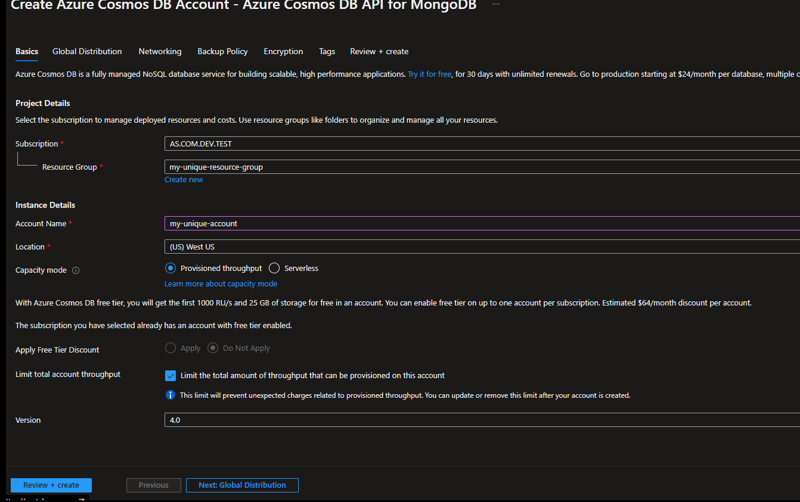

Click the "Review + create" button. Ensure that everything looks good, and then click the "Create" button.

# Step 4: Fork this repo

Fork this repo to your own github account by clicking the "fork" button in the top right corner.

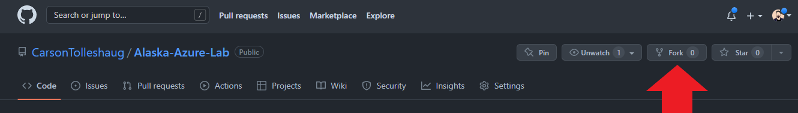

# Step 5: Setup CI/CD

Enable CI/CD to pull code from this repo and deploy into your azure app service. In the azure portal, navigate to the app service you made in Step 2 and click on the "Deployment Center".

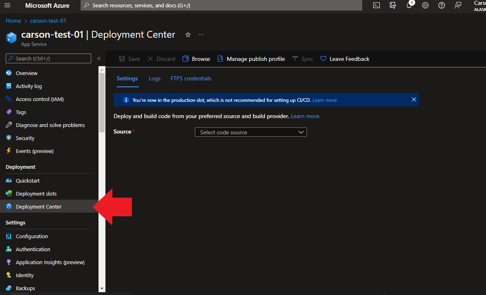

On the deployment center page, select `GitHub` from the source dropdown. Use the sign in button to log into your GitHub account.

- Select your github name as the Organization
- Select `Alaska-Azure-Lab` as the Repository
- Select `main` as the Branch

Lastly click `Save`, and once it's done saving click `Sync` to deploy the code.

## Viewing the site

You can find the url for your site on the Overview page.

You should now be able to go to your site's url and see this:

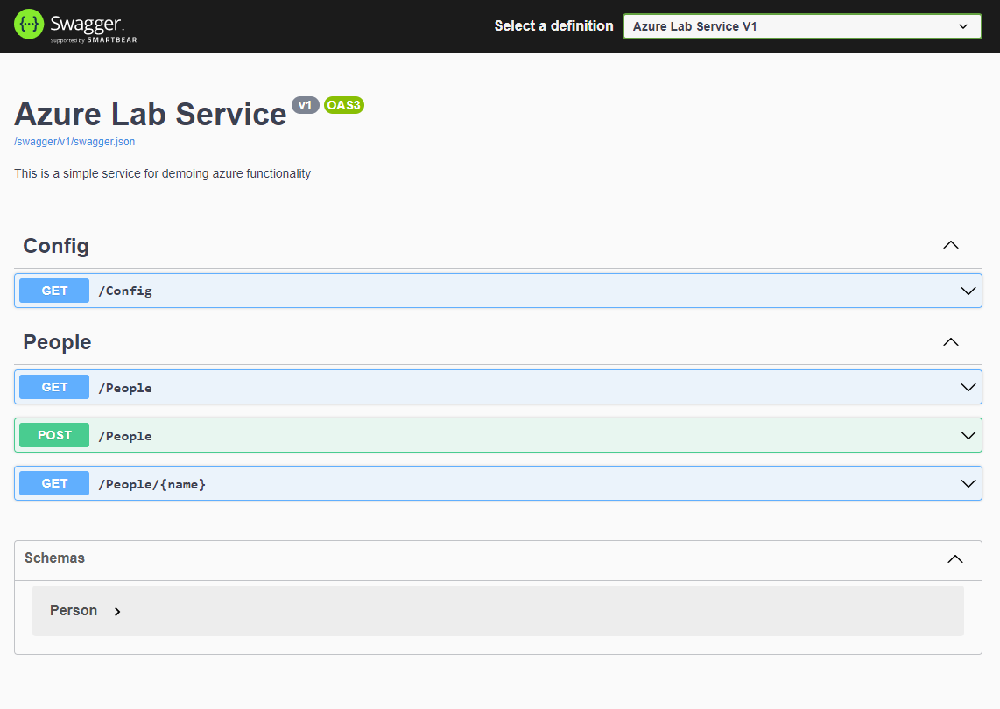

# Step 6: Add connection string to config

## Get the connection string

Navigate to your Cosmos DB. Go to the "Connection String" section and copy the "Primary Connection String".

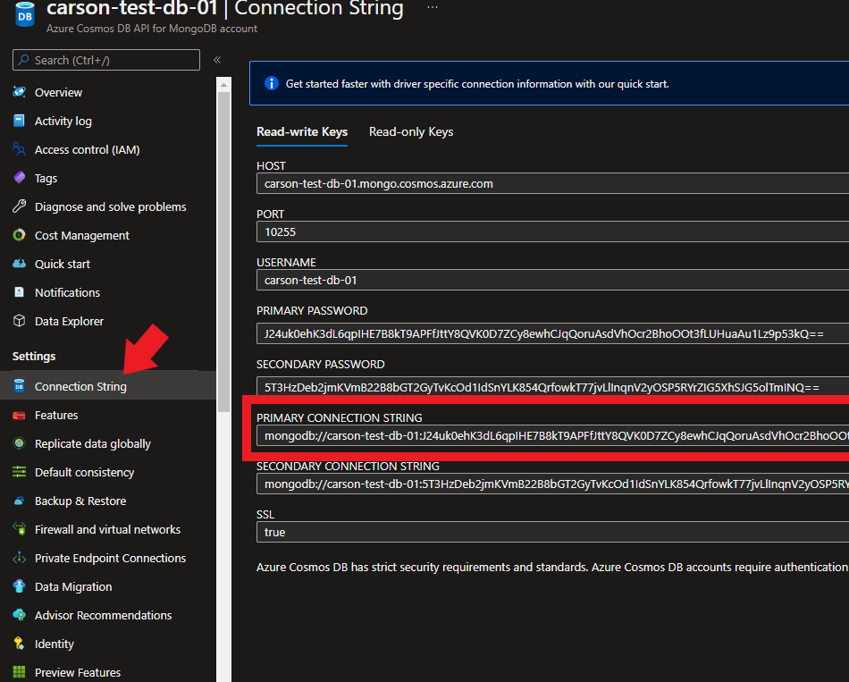

## Use the connection string

Navigate to your App Service. Go to the "Configuration" section.

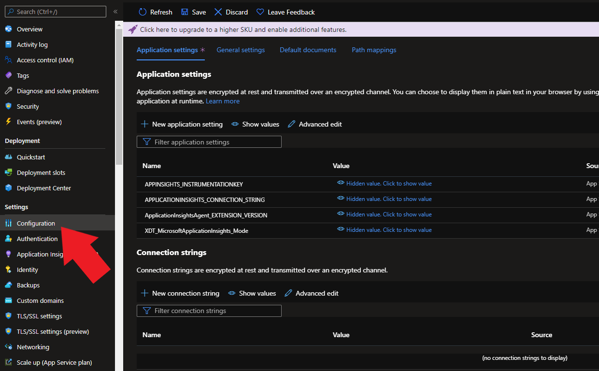

Add an application setting with the name `database__connectionString` and then paste the connection string you copied before into the value of this new setting.

Lastly click `Save`

# Step 7: Use the API and see the results in the DB

You should now be able to POST a person to the API and see it returned in one of the GET requests. After doing so you should also be able to see the person in the database. To view the contents of the database, go to the "Data Explorer" section in your Cosmos DB.

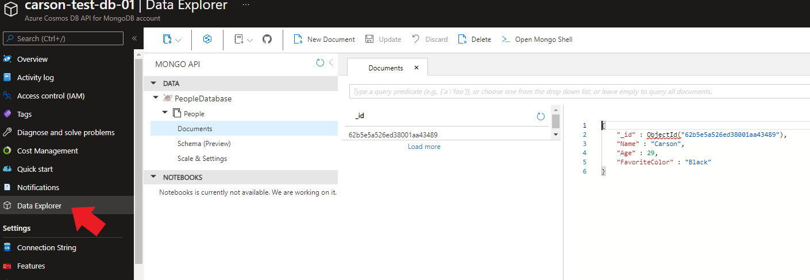